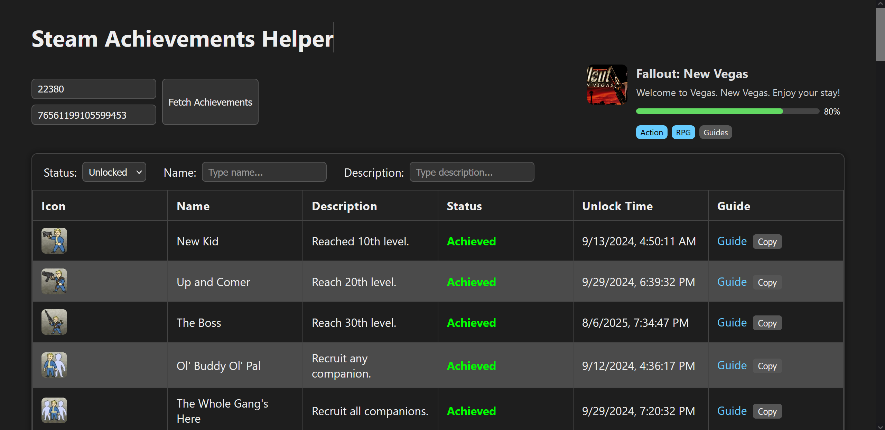

# 🎮 Steam Achievements Helper



A modern interface to fetch, filter, and visualize **Steam game achievements**.  
Built for clarity integates directly with the Steam Web API and metadata sources like Steam Store

---

## ✨ Features
- 🔍 Fetch achievements by **AppID** and **SteamID**
- Filter by unlocked / locked status
- 🧩 Live search by name or description

---

## Stack
- **Frontend:** HTML, CSS, JS
- **API Sources:**
  - `https://api.steampowered.com/ISteamUserStats/GetPlayerAchievements/v0001/`
  - `https://store.steampowered.com/api/appdetails?appids=<APPID>`
  - `https://steamcommunity.com/app/<APPID>/guides/`

---

## 🚀 Setup

### 1️⃣ Clone the repo
```bash
git clone https://github.com/yourusername/steam-achievements-helper.git
cd steam-achievements-helper
```

### Run in watchamaccalit whatever browser